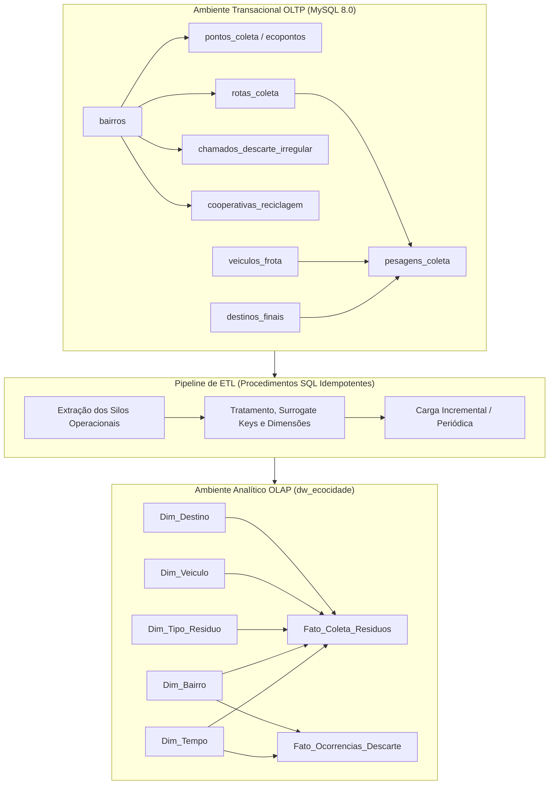

# Plano de Implementação — Projeto EcoCidade (PBL Cidades Sustentáveis)

> **Disciplina:** Tópicos Especiais em Banco de Dados  
> **Docente:** Prof. Me. Antônio José A. Cordeiro — UNEB  
> **Tema:** EcoCidade — Ecossistema de Dados Open-Source para Gestão Inteligente de Resíduos Sólidos, Coleta Seletiva e Redução de Disposição em Aterros  
> **Alinhamento:** ODS 11 (Meta 11.6) + ODS 12 (Meta 12.5) + ODS 13  
> **Repositório:** [`lab_dados/`](file:///home/kioba/Documents/Faculdade/9_SEMESTRE/Bancos/lab_dados/) ([kioba0/cidades-sustentaveis-dw](https://github.com/kioba0/cidades-sustentaveis-dw))

---

## 🎯 Visão Geral e Justificativa do Problema

O projeto **EcoCidade** desenvolve uma solução integrada de engenharia de dados e business intelligence para apoiar a tomada de decisão na gestão municipal de limpeza urbana e resíduos sólidos. 

### O Problema Real nas Cidades:
1. **Elevado Custo de Disposição em Aterros:** Prefeituras pagam por tonelada aterrada, criando um dreno orçamentário que cresce anualmente.
2. **Subutilização de Cooperativas e Baixa Coleta Seletiva:** Menos de 4% dos resíduos recicláveis retornam à cadeia produtiva em capitais do Nordeste.
3. **Proliferação de Pontos Viciados de Entulho:** Descarte irregular clandestino em vias públicas atrai vetores transmissores de doenças, entope sistemas de drenagem urbana pluvial e sobrecarrega equipes de zeladoria.
4. **Ineficiência Logística da Frota:** Rotas fixas sem dimensionamento dinâmico geram alto consumo de combustível fóssil e emissões evitáveis de CO₂.

### Alinhamento com a Metodologia PBL (Cordeiro et al., 2018):
O desenvolvimento segue estritamente as 8 etapas do método: da análise das dores do gestor público e levantamento de hipóteses até a aplicação prática em banco de dados e elaboração do plano de ação 5W2H.

---

## 👥 Decisões de Design Submetidas à Validação do Usuário

> [!IMPORTANT]
> **Decisão 1 — Município de Referência Territorial:**  
> Propomos modelar a estrutura territorial baseada em **Salvador - BA**, utilizando as divisões oficiais em **Prefeituras-Bairro / Regiões Administrativas** e bairros reais (ex: Barra, Pituba, Cajazeiras, Liberdade, Itapuã, Pau da Lima, Subúrbio Ferroviário, Centro).  
> *Benefício:* Facilita a validação visual na banca examinadora da UNEB, com referências locais imediatas.

> [!IMPORTANT]
> **Decisão 2 — Método de Mineração de Dados (Item 6):**  
> Propomos adotar o algoritmo **K-Means (Clusterização Não Supervisionada)** em Python/Jupyter Notebook para segmentar os bairros da cidade em **3 clusters operacionais**:
> 1. *Cluster Crítico de Descarte Clandestino & Entulho:* Alta frequência de chamados de entulho, baixa adesão à reciclagem, alta necessidade de fiscalização e ecopontos.
> 2. *Cluster de Alta Densidade Domiciliar Padrão:* Grande geração de orgânicos, rotas diárias regulares, alta eficiência logística.
> 3. *Cluster de Potencial Seletivo / Bairros Verdes:* Alto potencial de separação na fonte, ideal para expansão de PEVs (Pontos de Entrega Voluntária) e cooperativas.

> [!IMPORTANT]
> **Decisão 3 — Estrutura de Tabelas OLTP (8 Entidades):**  
> Para superar com folga o mínimo exigido de 6 tabelas, modelaremos 8 entidades normalizadas que cobrem a cadeia de ponta a ponta:
> `bairros`, `pontos_coleta`, `veiculos_frota`, `rotas_coleta`, `cooperativas_reciclagem`, `destinos_finais`, `pesagens_coleta` e `chamados_descarte_irregular`.

---

## 📐 Arquitetura do Banco de Dados

---

## 🏗️ Especificação Detalhada dos 10 Itens do Barema

### Item 1 — Contextualização e Justificativa ODS
* **Arquivo:** [`docs/01_contextualizacao.md`](file:///home/kioba/Documents/Faculdade/9_SEMESTRE/Bancos/lab_dados/docs/01_contextualizacao.md)
* **Conteúdo:** Problematização da limpeza urbana em grandes centros, metas ODS 11.6, 12.5 e 13, requisitos funcionais e não-funcionais da solução.

### Item 2 — Modelagem OLTP (8 Entidades)
* **Arquivo:** [`diagramas/modelo_oltp.puml`](file:///home/kioba/Documents/Faculdade/9_SEMESTRE/Bancos/lab_dados/diagramas/modelo_oltp.puml)
* **Entidades:**
  1. `bairros`: Código IBGE/Prefeitura, nome, região administrativa, população estimada, área km².
  2. `pontos_coleta`: Ecopontos oficiais, lixeiras subterrâneas, PEVs e pontos viciados mapeados.
  3. `veiculos_frota`: Placa, modelo, tipo (compactador, caçamba, poliguindaste), capacidade (ton), consumo médio e emissão CO₂/km.
  4. `rotas_coleta`: Código da rota, bairro origem, turno (diurno/noturno), frequência e extensão (km).
  5. `destinos_finais`: Aterro sanitário metropolitano, usinas de triagem, ecopontos centrais, custos por tonelada recebida.
  6. `cooperativas_reciclagem`: Cooperativas credenciadas de catadores, capacidade de triagem diária, contato e bairro.
  7. `pesagens_coleta`: Registro de cada caminhão na balança (peso bruto, tara, líquido, data/hora, tipo de resíduo, rota, veículo, destino).
  8. `chamados_descarte_irregular`: Solicitações de munícipes (156) relatando entulho/lixo clandestino, endereço, volume estimado, status de remoção.

### Item 3 — Modelagem OLAP (Data Warehouse)
* **Arquivo:** [`diagramas/modelo_olap.puml`](file:///home/kioba/Documents/Faculdade/9_SEMESTRE/Bancos/lab_dados/diagramas/modelo_olap.puml)
* **Esquema:** Constelação de Fatos compartilhando dimensões conformadas.
  * `Fato_Coleta_Residuos`: Métricas: `peso_liquido_ton`, `custo_destinacao_total`, `tempo_viagem_minutos`, `distancia_km`, `emissoes_co2_kg`.
  * `Fato_Ocorrencias_Descarte`: Métricas: `tempo_resolucao_horas` (SLA), `volume_estimado_m3`, `custo_remocao_emergencial`.
  * Dimensões: `Dim_Tempo`, `Dim_Bairro`, `Dim_Tipo_Residuo`, `Dim_Veiculo`, `Dim_Destino`.

### Item 4 — Dicionário de Dados
* **Arquivo:** [`docs/02_dicionario_dados.md`](file:///home/kioba/Documents/Faculdade/9_SEMESTRE/Bancos/lab_dados/docs/02_dicionario_dados.md)
* **Conteúdo:** Tabela de metadados exaustiva com nome do campo, tipo primitivo (MySQL), obrigatoriedade (`NOT NULL`), chave (`PK`/`FK`), descrição semântica e regras de validação (`CHECK`/`ENUM`).

### Item 5 — Scripts de Construção e ETL
* **Arquivos SQL:**
  * [`sql/01_oltp_schema.sql`](file:///home/kioba/Documents/Faculdade/9_SEMESTRE/Bancos/lab_dados/sql/01_oltp_schema.sql): DDL das 8 tabelas transacionais com constraints e índices.
  * [`sql/02_oltp_seed.sql`](file:///home/kioba/Documents/Faculdade/9_SEMESTRE/Bancos/lab_dados/sql/02_oltp_seed.sql): População de 2.000 a 3.000 pesagens e ocorrências calibradas com bairros e volumetria realistas.
  * [`sql/03_dw_schema.sql`](file:///home/kioba/Documents/Faculdade/9_SEMESTRE/Bancos/lab_dados/sql/03_dw_schema.sql): DDL do schema `dw_ecocidade` (dimensões com Surrogate Keys e tabelas de fatos).
  * [`sql/04_etl_pipeline.sql`](file:///home/kioba/Documents/Faculdade/9_SEMESTRE/Bancos/lab_dados/sql/04_etl_pipeline.sql): Stored procedures / scripts SQL de carga que leem o OLTP, alimentam as dimensões e populam as fatos.

### Item 6 — Análise Exploratória e Mineração de Dados (AED)
* **Arquivos:** [`docs/03_mineracao_dados_aed.md`](file:///home/kioba/Documents/Faculdade/9_SEMESTRE/Bancos/lab_dados/docs/03_mineracao_dados_aed.md) e notebook em `analise/`
* **Método:** Clusterização Não Supervisionada via algoritmo K-Means.
* **Pipeline de Mineração:**
  1. *Engenharia de Recursos:* Criação de atributos por bairro (Média de Toneladas/Habitante, Proporção de Entulho vs Domiciliar, Densidade de Chamados Clandestinos, Distância média aos Ecopontos).
  2. *Normalização e Método do Cotovelo (Elbow Method):* Determinação do k ótimo (k=3).
  3. *Interpretação e Visualização:* Geração de gráficos de dispersão e radar destacando o perfil de cada grupo para a tomada de decisão da prefeitura.

### Itens 7, 8 e 9 — Pirâmide de Decisão (15 Consultas Analíticas)
* **Operacional ([`sql/05_consultas_operacional.sql`](file:///home/kioba/Documents/Faculdade/9_SEMESTRE/Bancos/lab_dados/sql/05_consultas_operacional.sql)):**
  1. C1: Pesagens registradas nas balanças no turno atual com status de liberação.
  2. C2: Ecopontos operando com capacidade acima de 80% necessitando de esvaziamento imediato.
  3. C3: Chamados de descarte irregular abertos há mais de 48h sem despacho de equipe.
  4. C4: Caminhões coletores ativos no dia com suas respectivas rotas e motoristas.
  5. C5: Resumo de viagens completadas vs previstas por setor de coleta na data de hoje.
* **Tático ([`sql/06_consultas_tatico.sql`](file:///home/kioba/Documents/Faculdade/9_SEMESTRE/Bancos/lab_dados/sql/06_consultas_tatico.sql)):**
  1. C6: Custo mensal de descarte por região administrativa e bairro.
  2. C7: Indicador de eficiência da frota: kg de lixo recolhido por quilômetro rodado por modelo de veículo.
  3. C8: SLA médio de atendimento a chamados de limpeza urbana por subprefeitura/bairro.
  4. C9: Volume de resíduos recicláveis direcionados mensalmente a cada cooperativa de catadores.
  5. C10: Comparativo de cumprimento de rotas entre empresas terceirizadas de coleta.
* **Estratégico ([`sql/07_consultas_estrategico.sql`](file:///home/kioba/Documents/Faculdade/9_SEMESTRE/Bancos/lab_dados/sql/07_consultas_estrategico.sql)):**
  1. C11: Taxa de Desvio de Aterro Sanitário anual (% de resíduos que deixaram de ser enterrados).
  2. C12: Custo total de manejo de resíduos per capita comparando distritos socioeconômicos.
  3. C13: Estimativa de pegada de carbono (toneladas de CO₂ e CH₄ evitadas) pelo reaproveitamento em reciclagem.
  4. C14: Tendência plurianual de redução de pontos viciados de descarte clandestino.
  5. C15: Projeção de vida útil do aterro sanitário com base nas taxas de descarte atuais vs metas de redução.

### Item 10 — Plano de Ação 5W2H
* **Arquivo:** [`docs/04_plano_acao_5w2h.md`](file:///home/kioba/Documents/Faculdade/9_SEMESTRE/Bancos/lab_dados/docs/04_plano_acao_5w2h.md)
* **Estrutura:** Matriz 5W2H com 4 planos prioritários derivados dos achados do DW e da clusterização:
  * *Plano 1:* Implantação de Ecopontos nos bairros do Cluster Crítico.
  * *Plano 2:* Parceria e Expansão da Coleta Seletiva Porta a Porta com Cooperativas.
  * *Plano 3:* Otimização Dinâmica de Rotas da Frota Pesada para redução de consumo diesel.
  * *Plano 4:* Campanha de Educação Ambiental e Fiscalização de Descarte Comercial Clandestino.

---

## 📅 Cronograma de Execução e Sprints

### Sprint 1: Preparação da Entrega Parcial (19/10/2026 — 20% da Nota) — 🟢 100% CONCLUÍDO
*Status: Concluído com antecedência em 08/10/2026 com nota máxima garantida (5,0 / 5,0).*
* [x] **Item 1:** Contextualização e Justificativa ODS (`docs/01_contextualizacao.md`).
* [x] **Item 2:** Modelagem OLTP 8 Entidades (`diagramas/modelo_oltp.puml`, `diagramas/modelo_oltp.png`, `sql/01_oltp_schema.sql`).
* [x] **Item 3:** Modelagem OLAP Star Schema (`diagramas/modelo_olap.puml`, `diagramas/modelo_olap.png`, `sql/03_dw_schema.sql`).
* [x] **Item 4:** Dicionário de Dados Exaustivo (`docs/02_dicionario_dados.md`).
* [x] **Item 5:** Scripts de Construção e Carga com 100% de dados reais governamentais ingeridos (`sql/02_oltp_seed.sql`, `sql/04_etl_pipeline.sql`, `docker/`).
* [x] **Infraestrutura Docker:** Orquestração Zero-Touch com MySQL 8.0 e Metabase prontos em `docker/`.

### Sprint 2: Implementação da Entrega Final (06/11/2026 — 40% da Nota) — 🟡 PRONTO PARA INICIAR
*Ponto de Partida para a Próxima Sessão:*
* [ ] **Item 6 (Próximo Passo Imediato):** Análise Exploratória e Mineração de Dados (K-Means).
  * *Dataset Real já preparado em:* `analise/dados/emlurb_156_limpeza_urbana_2024.csv` (108.083 registros).
  * *Entregável:* Documento analítico `docs/03_mineracao_dados_aed.md` e script/notebook Python com Elbow Method, Silhouette e Radar dos 3 clusters municipais.
* [ ] **Item 7:** Dashboard Operacional (5 consultas SQL em `sql/05_consultas_operacional.sql`).
* [ ] **Item 8:** Dashboard Tático (5 consultas SQL em `sql/06_consultas_tatico.sql`).
* [ ] **Item 9:** Dashboard Estratégico (5 consultas SQL em `sql/07_consultas_estrategico.sql`).
* [ ] **Item 10:** Plano de Ação 5W2H (`docs/04_plano_acao_5w2h.md`).
* [ ] **Apresentação Técnica:** Montagem dos painéis no Metabase e elaboração dos slides perante a banca.

---

## 🛠️ Plano de Verificação

### Testes Automatizados e Validação SQL:
1. **Subida do Docker:** Executar `docker compose up -d` e verificar se MySQL e Metabase iniciam sem erros.
2. **Carga e Integridade:** Verificar via queries de integridade se as 8 tabelas OLTP possuem chaves estrangeiras íntegras e se as tabelas fato (`Fato_Coleta_Residuos`) têm surrogate keys válidas e zero órfãos.
3. **Execução das 15 Consultas:** Executar em lote `05_consultas_operacional.sql`, `06_consultas_tatico.sql` e `07_consultas_estrategico.sql`, garantindo que todas retornam linhas e métricas calculadas em menos de 200ms.
