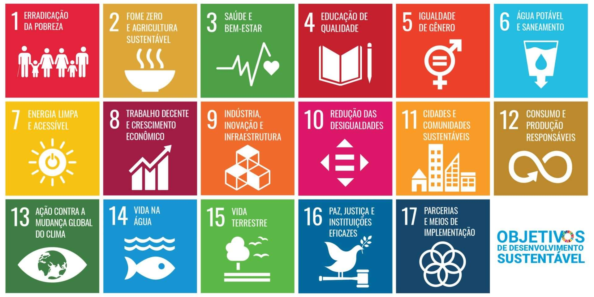
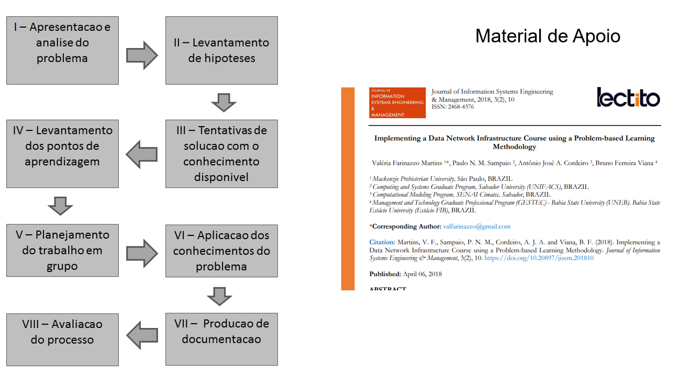

# Projeto Laboratório de Dados para Cidades Sustentáveis (PBL)

> **Disciplina:** Tópicos Especiais em Banco de Dados  
> **Professor:** Prof. Antônio Cordeiro  
> **Instituição:** Universidade do Estado da Bahia (UNEB)  
> **Metodologia:** Problem-Based Learning (PBL)  
> **Arquivo Original:** [`Projeto_TEBD_Laboratorio de Dados para Cidades Sustentaveis-PBL.docx`](file:///home/kioba/Documents/Faculdade/9_SEMESTRE/Bancos/lab_dados/materiais/Projeto_TEBD_Laboratorio%20de%20Dados%20para%20Cidades%20Sustentaveis-PBL.docx)

---

## 1. Descrição Geral

Este projeto tem como objetivo o desenvolvimento de um **ecossistema de banco de dados open-source**, orientado à resolução de problemas reais enfrentados por **prefeituras**, utilizando a metodologia **PBL (*Problem-Based Learning*)** e alinhado à **ODS 11 – Cidades e Comunidades Sustentáveis**.

As ODS (Objetivos de Desenvolvimento Sustentável) constituem uma agenda global estabelecida pela Organização das Nações Unidas (ONU), composta por 17 objetivos interdependentes que visam promover o desenvolvimento sustentável até 2030, abrangendo dimensões sociais, econômicas e ambientais. Nesse contexto, a **ODS 11 – Cidades e Comunidades Sustentáveis** tem como propósito tornar os espaços urbanos mais inclusivos, seguros, resilientes e sustentáveis, abordando temas como mobilidade urbana, planejamento territorial, gestão de resíduos, habitação, acesso a serviços públicos e redução de impactos ambientais.

Além da ODS 11, o projeto poderá estabelecer conexões secundárias com outras ODS, de acordo com a área escolhida e o problema abordado. Destacam-se, por exemplo:
* **ODS 3 (Saúde e Bem-Estar):** no contexto de sistemas de gestão hospitalar e epidemiológica municipal;
* **ODS 4 (Educação de Qualidade):** relacionada à gestão educacional e indicadores de desempenho escolar;
* **ODS 6 (Água Potável e Saneamento):** voltada ao monitoramento de recursos hídricos e saneamento básico;
* **ODS 9 (Indústria, Inovação e Infraestrutura):** no desenvolvimento de soluções tecnológicas e sistemas inteligentes;
* **ODS 13 (Ação Contra a Mudança Global do Clima):** especialmente em projetos voltados ao monitoramento ambiental, alagamentos e sustentabilidade urbana.

Dessa forma, o projeto não apenas consolida competências técnicas de Tópicos Especiais em Banco de Dados, mas também promove uma visão sistêmica e aplicada da tecnologia como instrumento de transformação social e urbana.

---

## 2. Critérios de Avaliação (Barema)

| Item | Entregável | Descrição | Pontuação Máxima |
|:---:|---|---|:---:|
| **1** | **Contextualização** | Texto com requisitos, problematização e justificativa da ODS escolhida. | 1,0 |
| **2** | **Modelagem OLTP** | Definição de no mínimo 6 entidades em um ambiente OLTP relacional. | 1,0 |
| **3** | **Modelagem OLAP** | Criação do modelo multidimensional (Data Warehouse). | 1,0 |
| **4** | **Dicionário de Dados** | Documentação detalhada dos atributos, tipos primitivos e restrições de integridade. | 1,0 |
| **5** | **Script de Construção** | Arquivo SQL para criação completa dos ambientes OLTP e OLAP. | 1,0 |
| **6** | **Análise Exploratória de Dados (AED)** | Definição de um problema e adoção de um método de mineração de dados para a resolução e explicação do método. | 1,0 |
| **7** | **Dashboard Operacional** | Mínimo de 5 consultas SQL (enunciado de negócio + código) voltadas ao nível operacional. | 1,0 |
| **8** | **Dashboard Tático** | Mínimo de 5 consultas SQL (enunciado de negócio + código) voltadas ao nível tático. | 1,0 |
| **9** | **Dashboard Estratégico** | Mínimo de 5 consultas SQL (enunciado de negócio + código) voltadas ao nível estratégico. | 1,0 |
| **10** | **Plano de Ação (5W2H)** | Criação de um plano de ação para orientar tarefas a partir do processo de tomada de decisão. | 1,0 |
| **TOTAL** | | | **10,0** |

---

## 3. Critérios para Avaliação da Apresentação do Projeto

### 3.1 Feedback (Cumprimento do Cronograma — 20% da Avaliação)
No dia do feedback, cada equipe deverá apresentar uma **entrega parcial**, contemplando a evolução do cronograma, com desenvolvimento dos **itens de 1 a 5 (no mínimo)**:
* 🟢 **Verde:** 20% (Progresso adequado dentro do esperado)
* 🟡 **Amarelo:** 10% (Atenção: progresso abaixo do esperado)
* 🔴 **Vermelho:** 0% (Crítico: sem avanço ou muito insuficiente)

### 3.2 Critérios da Apresentação Final (40% da Nota Geral)
* **Domínio do conteúdo (Nota Individual):** 25%
* **Clareza da Apresentação:** 20%
* **Concatenação de Ideias:** 25%
* **Resposta a Argumentações:** 30%
* **Originalidade / Inovação:** 20% *(Pontuação Extra/Bônus)*

---

## 4. Cronograma Oficial

| Entregas | Data | Escopo Mínimo |
|---|:---:|---|
| **Parcial do projeto (Feedback)** | **19/10/2026** | Itens 1 a 5 (Contextualização, OLTP 6+ tabelas, OLAP, Dicionário e Scripts SQL) |
| **Entrega Final do Projeto** | **06/11/2026** | Projeto completo (Itens 1 a 10) |
| **Início das Apresentações** | **06/11/2026** | Apresentação em banca com avaliação individual |

---

## 5. Método para Desenvolvimento da Atividade em Grupo (PBL)

A metodologia segue o trabalho científico coautorado pelo **Prof. Antônio José A. Cordeiro**:

> **Referência:**  
> Martins, V. F., Sampaio, P. N. M., Cordeiro, A. J. A., & Viana, B. F. (2018).  
> *Implementing a Data Network Infrastructure Course using a Problem-based Learning Methodology*.  
> **Journal of Information Systems Engineering & Management (JISEM)**, 3(2), 10.  
> DOI: [10.20897/jisem.201810](https://doi.org/10.20897/jisem.201810) | IEEE Doc: [7975684](https://ieeexplore.ieee.org/document/7975684)

### As 8 Etapas do Fluxo PBL:
1. **Etapa I — Apresentação e Análise do Problema:** Leitura do cenário municipal, identificação das dores públicas e alinhamento com a ODS 11.
2. **Etapa II — Levantamento de Hipóteses:** O que causa os gargalos na gestão urbana? Quais dados podem revelar essas causas?
3. **Etapa III — Tentativas de Solução com Conhecimento Disponível:** Modelagem inicial e consultas exploratórias.
4. **Etapa IV — Levantamento dos Pontos de Aprendizagem:** Lacunas técnicas (ex: mineração de dados, dimensional complexo, ETL para dados governamentais).
5. **Etapa V — Planejamento do Trabalho em Grupo:** Divisão de papéis, cronograma, sprints e prazos.
6. **Etapa VI — Aplicação dos Conhecimentos ao Problema:** Desenvolvimento do OLTP, pipeline ETL, DW, Mineração e Consultas dos 3 níveis.
7. **Etapa VII — Produção de Documentação:** Elaboração do dicionário de dados, 5W2H e relatórios executivos.
8. **Etapa VIII — Avaliação do Processo:** Validação das entregas parciais e ensaio para a apresentação final.
